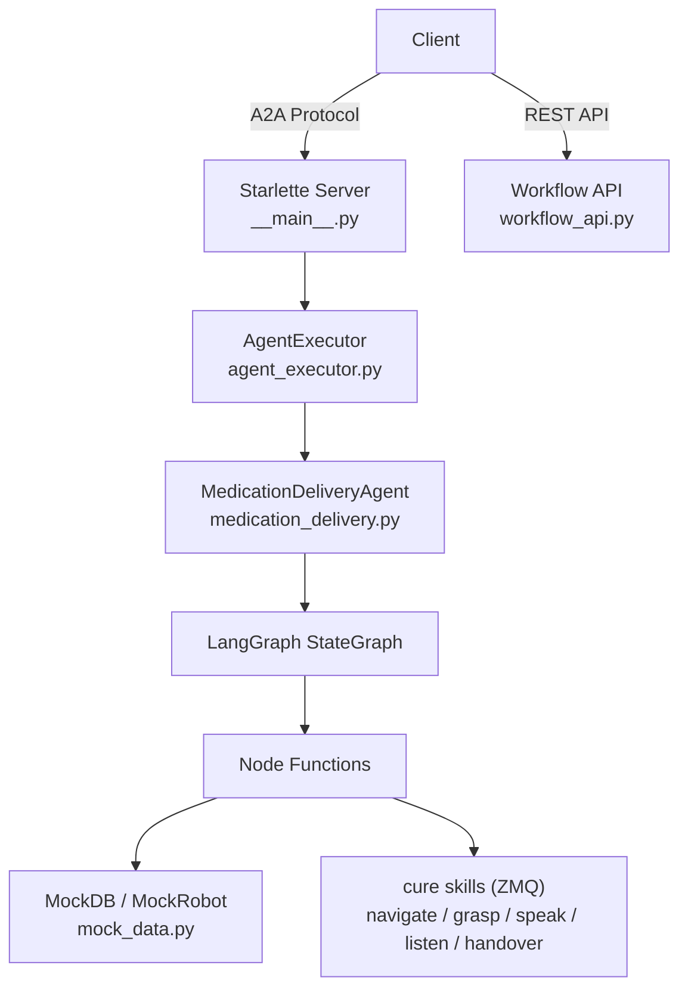

# Backend — LangGraph A2A Agent

Medication delivery robot agent built with **LangGraph** + **A2A Protocol**, deployed as a Starlette ASGI server.

## Architecture



## Module Structure

```
app/
├── __init__.py                  # Package version
├── __main__.py                  # Server entry point (click CLI)
├── agent_executor.py            # A2A ↔ LangGraph bridge
├── workflow_api.py              # REST endpoints for dashboard
├── camera_api.py                # Video streaming endpoints (D405, D435if)
└── healthcare/
    ├── __init__.py              # Public exports
    ├── medication_delivery.py   # StateGraph + nodes + agent class
    └── mock_data.py             # Mock database, MockNLU, robot actions
```

## API Endpoints

### A2A Protocol

| Endpoint | Method | Description |
|---|---|---|
| `/.well-known/agent-card.json` | GET | Agent metadata and capabilities (primary) |
| `/agent.json` | GET | Agent metadata and capabilities (legacy alias) |
| `/` | POST | A2A JSON-RPC endpoint |

**A2A JSON-RPC methods**

| Method | Description |
|---|---|
| `message/send` | Execute medication delivery request and return task/result |

If the input is a capability question (`What can you do?` / `你會做什麼`), the agent returns a friendly capabilities summary instead of a parse-error.

### Workflow API

| Endpoint | Method | Description |
|---|---|---|
| `/api/workflow` | GET | Graph structure (nodes + edges) for dashboard |
| `/api/workflow/execute` | POST | Trigger execution, return result |
| `/api/workflow/execute/stream` | POST | SSE streaming execution |

**SSE event types** (`/api/workflow/execute/stream`): `node_start`, `node_end`, `log`, `done`, `error`

#### `GET /api/workflow` Response

```json
{
  "nodes": [
    { "id": "confirm_task", "label": "confirm_task", "type": "process", "status": "pending" }
  ],
  "edges": [
    { "from": "__start__", "to": "confirm_task" }
  ]
}
```

## LangGraph Workflow

```
[Start]
   ↓
confirm_task ──(fail)──────────────────────────────────→ handle_error
   ↓ (success)                                                 ↓
nav_to_pharmacy                                         return_to_origin
   ↓                                                           ↓
pickup_med ──(fail)──────────────────────────────────→ [End]
   ↓ (success)
nav_to_patient ──(fail)──────────────────────────────→ handle_error
   ↓ (success)
delivery ──(fail)────────────────────────────────────→ handle_error
   ↓ (success)
check_patient_identity ──(verified)──→ return_to_origin → [End]
   ↑ (retry, up to 3x)    ↓ (fail)
   └───────────────── handle_error
```

**Nodes:** `confirm_task`, `nav_to_pharmacy`, `pickup_med`, `nav_to_patient`, `delivery`, `check_patient_identity`, `handle_error`, `return_to_origin`

### State Definition (`AgentState`)

| Field | Type | Description |
|---|---|---|
| `patient_name` | `str` | Target patient name |
| `medication_name` | `str` | Medication to deliver |
| `current_location` | `str` | Robot's current location |
| `task_status` | `str` | Current workflow status |
| `target_detected` | `bool` | Medication detected and grasped |
| `identity_verified` | `bool` | Patient identity verified via voice |
| `identity_check_retries` | `int` | Number of identity check attempts (max 3) |
| `errors` | `List[str]` | Accumulated errors (reducer: append) |
| `history` | `List[str]` | Execution log (reducer: append) |
| `executed_nodes` | `List[str]` | Nodes that have run (reducer: append) |

## Environment Variables

| Variable | Required | Default | Description |
|---|---|---|---|
| `PORT` | No | `9999` | Server port |
| `model_source` | No | `google` | LLM provider (`google` / `openai`) |
| `GOOGLE_API_KEY` | Conditional | — | Required if `model_source=google` |
| `OPENAI_API_KEY` | Conditional | — | Required if `model_source=openai` |

## Quick Start

See [INSTALL.md](./INSTALL.md) for full dependency setup (includes private `cure` and `stretch3-zmq-core` packages).

```bash
# After install:
python -m app --host localhost --port 9999

# Test CLI directly (bypasses A2A)
python -m app.workflows.medication_delivery 張小明 阿斯匹靈
```

