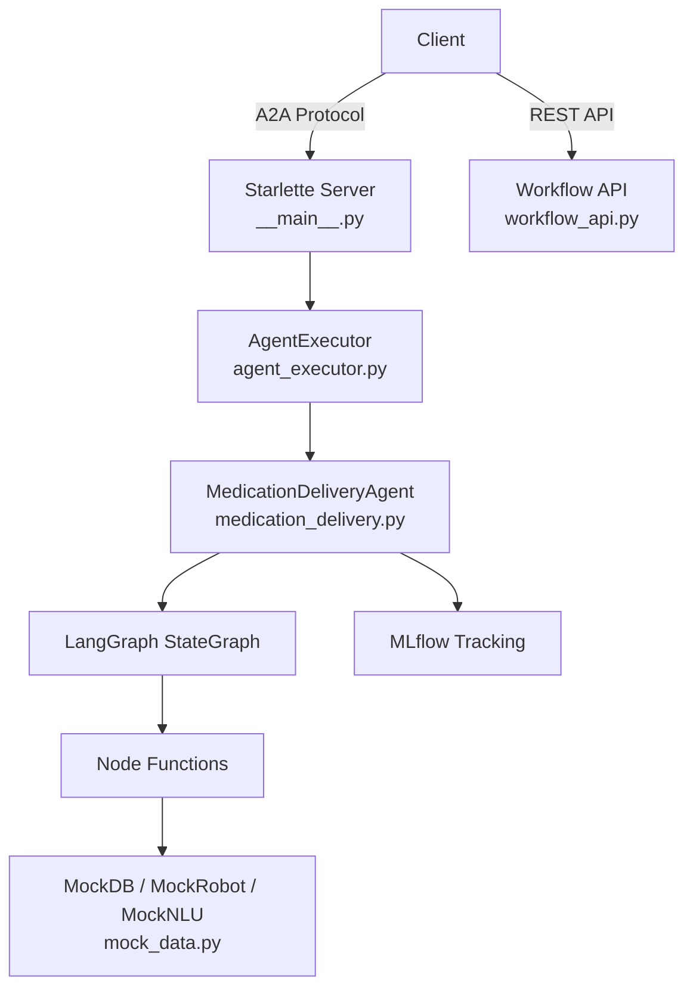

# Backend — LangGraph A2A Agent

Medication delivery robot agent built with **LangGraph** + **A2A Protocol**, deployed as a Starlette ASGI server.

## Architecture



## Module Structure

```
app/
├── __init__.py                  # Package version
├── __main__.py                  # Server entry point (click CLI)
├── agent_executor.py            # A2A ↔ LangGraph bridge
├── workflow_api.py              # [NEW] REST endpoints for dashboard
└── healthcare/
    ├── __init__.py              # Public exports
    ├── medication_delivery.py   # StateGraph + nodes + agent class
    └── mock_data.py             # Mock database, robot, NLU
```

## API Endpoints

### A2A Protocol (Existing)

| Endpoint | Method | Description |
|---|---|---|
| `/agent-card` | GET | Agent metadata and capabilities |
| `/tasks` | POST | Execute a medication delivery task |
| `/tasks/{id}` | GET | Get task status |
| `/tasks/{id}/cancel` | POST | Cancel running task |

### Workflow API (New)

| Endpoint | Method | Description |
|---|---|---|
| `/api/workflow` | GET | Graph structure (nodes + edges) for dashboard |
| `/api/workflow/execute` | POST | Trigger execution, return result |

#### `GET /api/workflow` Response

```json
{
  "nodes": [
    { "id": "nlu_parser", "name": "nlu_parser", "label": "nlu_parser_node", "type": "process", "status": "pending" },
    { "id": "nav_to_pharmacy", "name": "nav_to_pharmacy", "label": "navigate_to_pharmacy_node", "type": "process", "status": "pending" }
  ],
  "edges": [
    { "from": "__start__", "to": "nlu_parser" },
    { "from": "nlu_parser", "to": "nav_to_pharmacy" }
  ]
}
```

## LangGraph Workflow

```
[Start] → nlu_parser → nav_to_pharmacy → pickup_med → delivery → check_patient_identity → [End]
              ↓                                ↓
         handle_error ←──────────────── handle_error
              ↓
            [End]
```

### State Definition (`AgentState`)

| Field | Type | Description |
|---|---|---|
| `instruction` | `str` | Original voice command |
| `patient_name` | `str` | Parsed patient name |
| `medication_name` | `str` | Parsed medication name |
| `current_location` | `str` | Robot's current location |
| `task_status` | `str` | Current workflow status |
| `target_detected` | `bool` | Medication found by vision |
| `identity_verified` | `bool` | Patient face verified |
| `errors` | `List[str]` | Accumulated errors (reducer: append) |
| `history` | `List[str]` | Execution log (reducer: append) |

## Environment Variables

| Variable | Required | Default | Description |
|---|---|---|---|
| `PORT` | No | `9999` | Server port |
| `model_source` | No | `google` | LLM provider (`google` / `openai`) |
| `GOOGLE_API_KEY` | No* | — | Gemini API key |
| `OPENAI_API_KEY` | No* | — | OpenAI API key |
| `MLFLOW_TRACKING_URI` | No | `file:./mlruns` | MLflow tracking location |

*API keys optional for demo mode with mock data.

## Quick Start

```bash
# Install
pip install -e .

# Run
python -m app --host 0.0.0.0 --port 9999

# Test CLI directly
python -m app.healthcare.medication_delivery "請將阿斯匹靈送給張小明"

# MLflow dashboard
mlflow ui --port 5001
```

## Docker

```bash
docker build -t langgraph-a2a-backend .
docker run -p 9999:9999 -e GOOGLE_API_KEY=xxx langgraph-a2a-backend
```
