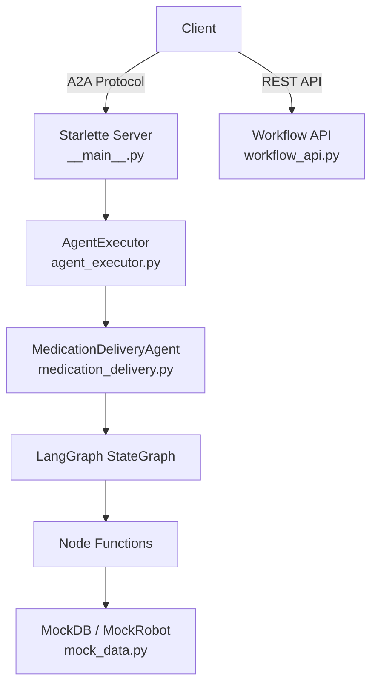

# Backend — LangGraph A2A Agent

Medication delivery robot agent built with **LangGraph** + **A2A Protocol**, deployed as a Starlette ASGI server.

## Architecture



## Module Structure

```
app/
├── __init__.py                  # Package version
├── __main__.py                  # Server entry point (click CLI)
├── agent_executor.py            # A2A ↔ LangGraph bridge
├── workflow_api.py              # [NEW] REST endpoints for dashboard
└── healthcare/
    ├── __init__.py              # Public exports
    ├── medication_delivery.py   # StateGraph + nodes + agent class
    └── mock_data.py             # Mock database, robot actions
```

## API Endpoints

### A2A Protocol (Existing)

| Endpoint | Method | Description |
|---|---|---|
| `/.well-known/agent-card.json` | GET | Agent metadata and capabilities (primary) |
| `/.well-known/agent.json` | GET | Agent metadata and capabilities (legacy alias) |
| `/` | POST | A2A JSON-RPC endpoint |

#### A2A JSON-RPC methods

| Method | Description |
|---|---|
| `message/send` | Execute medication delivery request and return task/result |

#### Intro query behavior

If the input is an introduction/capability question (for example `What can you do?` or `你會做什麼`), the agent returns a friendly capabilities summary as a completed task artifact (`result.artifacts[].parts[].text`) instead of a parse-error message.

### Workflow API (New)

| Endpoint | Method | Description |
|---|---|---|
| `/api/workflow` | GET | Graph structure (nodes + edges) for dashboard |
| `/api/workflow/execute` | POST | Trigger execution, return result |

#### `GET /api/workflow` Response

```json
{
  "nodes": [
    { "id": "nav_to_pharmacy", "name": "nav_to_pharmacy", "label": "navigate_to_pharmacy_node", "type": "process", "status": "pending" },
    { "id": "pickup_med", "name": "pickup_med", "label": "pickup_medication_node", "type": "process", "status": "pending" }
  ],
  "edges": [
    { "from": "__start__", "to": "nav_to_pharmacy" },
    { "from": "nav_to_pharmacy", "to": "pickup_med" }
  ]
}
```

## LangGraph Workflow

```
[Start] → nav_to_pharmacy → pickup_med → delivery → check_patient_identity → [End]
                                 ↓            ↓               ↓
                            handle_error ← handle_error ← handle_error
                                 ↓
                               [End]
```

### State Definition (`AgentState`)

| Field | Type | Description |
|---|---|---|
| `patient_name` | `str` | Target patient name |
| `medication_name` | `str` | Medication to deliver |
| `current_location` | `str` | Robot's current location |
| `task_status` | `str` | Current workflow status |
| `target_detected` | `bool` | Medication detected and grasped |
| `identity_verified` | `bool` | Patient identity verified via voice |
| `errors` | `List[str]` | Accumulated errors (reducer: append) |
| `history` | `List[str]` | Execution log (reducer: append) |

## Environment Variables

| Variable | Required | Default | Description |
|---|---|---|---|
| `PORT` | No | `9999` | Server port |
| `model_source` | No | `google` | LLM provider (`google` / `openai`) |
| `GOOGLE_API_KEY` | No* | — | Gemini API key |
| `OPENAI_API_KEY` | No* | — | OpenAI API key |

*API keys optional for demo mode with mock data.

## Quick Start

```bash
# Create venv (Python 3.12+)
python3.12 -m venv .venv
source .venv/bin/activate

# Install (cure needs --no-deps due to stretch3-zmq-core)
pip install --no-deps "cure @ git+https://github.com/lnfu/cure.git@no-detection"
pip install -e .

# Run
python -m app --host 0.0.0.0 --port 9999

# Test CLI directly
python -m app.healthcare.medication_delivery 張小明 阿斯匹靈
```

## Docker

```bash
docker build -t langgraph-a2a-backend .
docker run -p 9999:9999 -e GOOGLE_API_KEY=xxx langgraph-a2a-backend
```
